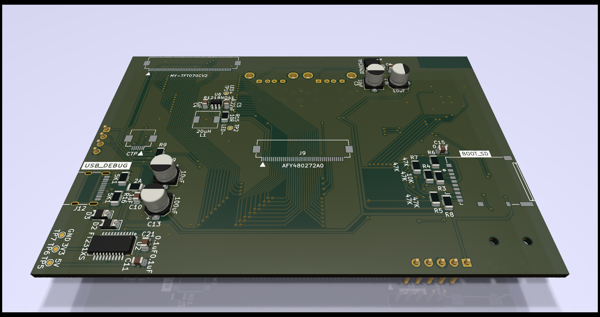
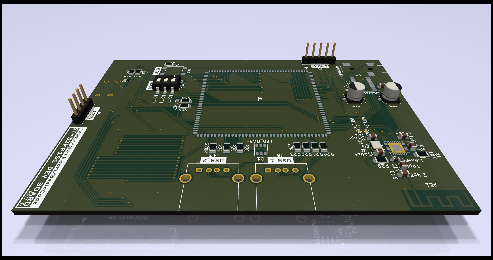

# STM32MP151 Dev Board
**Rev B**
  
**NOTE: There are issues with this board. The WiFi, and the sound do not work (yes, that's basically all of the peripherals).**
  
A *minimal* STM32MP151 single-board-computer PCB, designed in KiCad, based on a [MYiR SoM](https://au.mouser.com/ProductDetail/MYIR/MYC-YA151C-256N256D-65-C-T?qs=e8oIoAS2J1SxKfhSw3h3gA%3D%3D). This project is intended as a minimal implementation of an ARM based Linux system used for learning Buildroot, the Linux kernel, the device tree system, and PCB design. The design uses hand-solderable parts (intermediate skill level), a 2-layer PCB design which can be manufactured by any PCB manufacturer, and a minimal set of peripherals.
  
**NOTE** that this project is a learning process and I a have no professional experience with PCB layout - don't use this as a reference design. That said, if it works for your purpose, please feel free to modify or use it.

## Software

* [Buildroot external tree](https://github.com/BasicCode/STM32MP15x_Dev_Board)

## Hardware

* [Schematic](schematic.pdf)
* [PCB available from OSH Park](https://oshpark.com/shared_projects/CuSocwHZ)
* [Parts list](https://www.digikey.com.au/en/mylists/list/Z7PZFZ0LWC)

### Specifications
* STM32MP151 ARM Cortex A7 running at 650MHz
* 256MB DDR3 RAM
* 256MB NAND Flash (not used in this example)
* 4.3-inch, OR 7-inch LCD with touch
* 2x USB 2.0 host ports
* USB-C power and serial port
* Wifi
* 3.5mm Audio Out

### Parts
A parts list is available on Digikey with **most** of the components, as well as the included [BoM file](STM32MP151_Dev_Board.csv). Please double check the Digikey parts list against the BoM before ordering, in case some components are missing. The [MYiR SoM](https://au.mouser.com/ProductDetail/MYIR/MYC-YA151C-256N256D-65-C-T?qs=e8oIoAS2J1SxKfhSw3h3gA%3D%3D) is only available from Mouser or directly from the manufacturer.

## Assembly
Components can be soldered by hand with some difficulty and patience. Some peripherals which are more difficult to solder (like WiFi), or not needed, can be left unpopulated. The minimum working example for this system is just the system-on-module, and the *UART* or *SWDIO* header, however this isn't very useful or interesting and so the other peripherals are included for fun.

## Bugs
* WiFi chipset doesn't seem to work. I believe it is connected correctly, Linux seems to recognise the chip and attempt to load the driver, however the driver fails to load.
* The PCM3060 audio chipset has not been tested yet. May not even work.